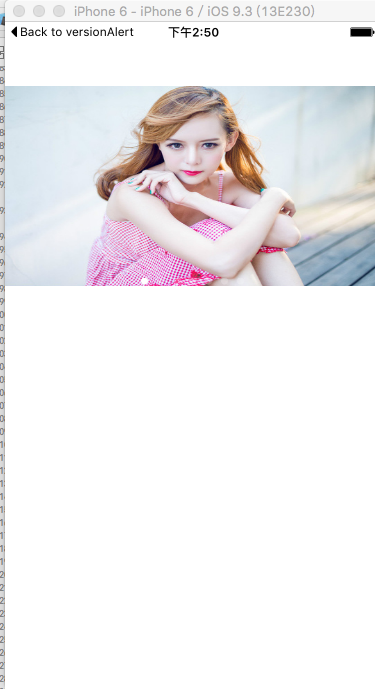
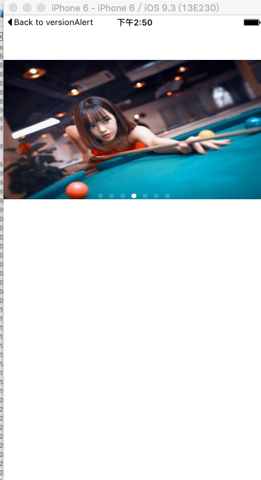

# CycleScrollView-Swift

<html>
<body>
<h2>什么是 CycleScrollView-Swift</h2>

这是一个基于swift语言实现图片轮播的封装

<h2>效果图展示</h2>

<h3>效果图1</h3>

<h3>效果图2</h3>

<h2>使用方法</h2>

//实例化进行添加在指定的View上面 
let cycleView = CycleScrollView.init(frame: CGRectMake(0, 64, CGRectGetWidth(self.view.frame), 200), animationDuration: 3.0) 
        cycleView.backgroundColor = UIColor.orangeColor() 
        self.view.addSubview(cycleView) 
        
//设置轮播图的数组URL 
        let dataArray = ["http://img04.sogoucdn.com/app/a/100520020/50c11a6a4b7a4da664e93a9cf4c061ce", 
                         "http://img04.sogoucdn.com/app/a/100520024/1f9163519dac6b2138c7d96b5598467e", 
                         "http://img01.sogoucdn.com/app/a/100520024/e2f057ede9d3cafabed15418bad2ee17", 
                         "http://img01.sogoucdn.com/app/a/100520020/2001859ba6fca0a525728c7568782d89", 
                         "http://img04.sogoucdn.com/app/a/100520024/f4d580ab0d9f5d514c9471b23bba0561", 
                         "http://img03.sogoucdn.com/app/a/100520024/30e8009fb8710f519b565b1cd17df7ec", 
                         "http://img02.sogoucdn.com/app/a/100520020/992e6ea334d3d1c34abfa5ea1ec0978a"] 
  //创建加载图片的ImageView 
        for index in 0..<dataArray.count { 
            let imageView = UIImageView.init(frame: CGRectMake(0, 0, CGRectGetWidth(self.view.frame), 200)) 
            imageView.sd_setImageWithURL(NSURL(string: dataArray[index])) 
            self.imageViewArray.addObject(imageView) 
        }        
        
        
        //闭包返回相应的View  
        cycleView.fetchContentViewAtIndex = {(pageIndex: NSInteger) in  
            return (self.imageViewArray[pageIndex] as! UIView)  
        }  
          
        
        //这个是吧所有的URL传过去，这一步必须做  
        cycleView.imageURLArray = dataArray  
        //传入相应的count  
        cycleView.totalPageCount = self.imageViewArray.count  
        //设置pageContol的count  
        cycleView.pageControl?.numberOfPages = self.imageViewArray.count  
        //点击的闭包  
        cycleView.tapActionBlock = { (pageIndex: NSInteger) in  
            print(pageIndex)  
        }  
       

</body>

</html>